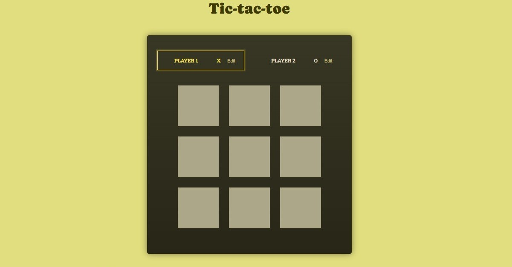

# Tic-Tac-Toe

Este é um projeto de um jogo da velha (Tic-Tac-Toe) desenvolvido em React. O jogo permite que dois jogadores se revezem para fazer suas jogadas, determinando o vencedor com base nas combinações de vitória predefinidas ou identificando um empate se todas as células forem preenchidas sem um vencedor.

## Screenshot



## Funcionalidades

- **Jogo da Velha para Dois Jogadores**: Dois jogadores, "X" e "O", podem se revezar para fazer suas jogadas.
- **Vencedor**: O jogo verifica automaticamente se um jogador ganhou após cada jogada.
- **Empate**: Detecta empate quando todas as células estão preenchidas e não há vencedor.
- **Log de Turnos**: Um log que exibe os turnos realizados durante o jogo.
- **Alteração de Nome dos Jogadores**: Permite que os jogadores alterem seus nomes.

## Pré-requisitos

- Node.js
- Yarn (ou npm)

## Instalação
```bash
git clone https://github.com/seu-usuario/tic-tac-toe.git
cd tic-tac-toe
yarn install ou npm install
npm start ou yarn start

